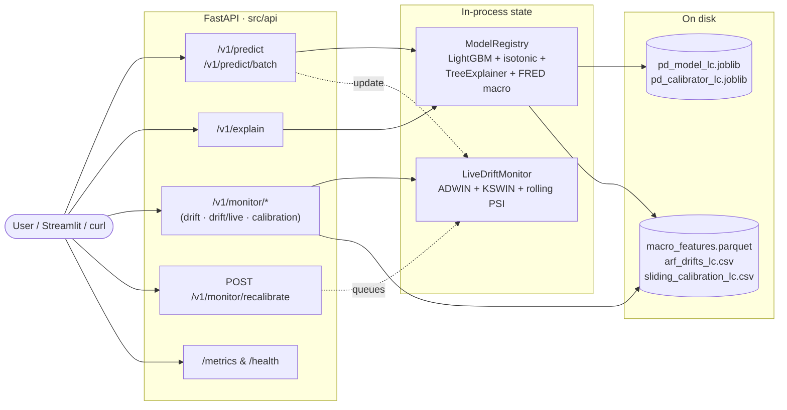

# Credit Risk Portfolio — Adaptive PD pipeline with drift-aware explainability

[](https://github.com/Caio-Fis/credit-risk-portfolio/actions/workflows/ci.yml)
[](https://www.python.org/downloads/release/python-3110/)
[](https://credit-risk-portfolio.vercel.app)
[](https://credit-risk-portfolio-gpnlnaabd9q3ddfubdugz6.streamlit.app)
[](https://huggingface.co/spaces/Caio-Fis/credit-risk-api)

> **▶️ Try it (bilingual PT/EN web app):** [credit-risk-portfolio.vercel.app](https://credit-risk-portfolio.vercel.app)
> **Streamlit lab:** [credit-risk-portfolio-...streamlit.app](https://credit-risk-portfolio-gpnlnaabd9q3ddfubdugz6.streamlit.app)
> **Live API (FastAPI on HF Spaces):** [Caio-Fis-credit-risk-api.hf.space/docs](https://Caio-Fis-credit-risk-api.hf.space/docs)

---

## The problem

Two compounding facts about credit risk make the textbook recipe insufficient.

**First, the data is non-stationary by construction.** A PD model trained on 2007–2013 data sees a borrower mix, a default rate, and a macroeconomic regime that no longer exist by 2017. The model does not "fail" — its ranking ability can stay flat while the probabilities themselves stop matching reality. AUROC lies; Brier and calibration slope tell the truth.

**Second, the single score collapses context.** A 650 may be perfectly adequate for a 30-day working-capital loan and grossly inadequate for a 48-month investment loan. Same borrower, radically different risks. Bundling everything into one number throws away exactly the information that pricing needs.

This project addresses both: a static PD baseline as the honest starting point, then an adaptive layer on top — drift detection, sliding-window calibration, time-aware SHAP — that demonstrates *how* models degrade and *what* it takes to keep them honest under real concept drift.

---

## The solution — architecture

A two-track pipeline:

**v1 — Static baseline (Home Credit).** Classical PD + LGD with bureau enrichment, isotonic calibration, SHAP waterfalls per contract. Strong AUROC (0.78) because the bureau features carry most of the signal. Lives in `notebooks/legacy/` and the `*_pd_model.py` family.

**v2 — Adaptive layer (LendingClub 2007–2018 + FRED macro).** Champion/challenger with four innovations:
1. **Strict temporal evaluation** — `rolling_oot_evaluation` retrains yearly, `frozen_oot_evaluation` freezes once and watches it decay.
2. **Online challenger** — Adaptive Random Forest (River) with ADWIN on error + KSWIN on score distribution + simulated 90-day label delay.
3. **Sliding-window calibration** — isotonic refit monthly over a 6–12 month window with explicit label-delay handling.
4. **Adaptive SHAP** — TreeSHAP rebaselined per month + per-risk-decile SHAP + an incremental Ridge surrogate.

Each layer is independently testable and the artefact set (charts in `artifacts/`) is reproducible from `make pipeline-lc`.

---

## Project structure

```
credit-risk-portfolio/
│
├── README.md                              ← you are here
├── pyproject.toml                         ← uv-managed deps, river + pyarrow added
├── Makefile                               ← `make pipeline-lc` for v2, `make pipeline` for v1
├── .github/workflows/ci.yml               ← CI on each push
│
├── data/
│   ├── raw/{lendingclub,home_credit}      ← .gitignored
│   ├── processed/                         ← parquet feature stores + OOS predictions + metrics CSVs
│   └── schemas/lendingclub.json           ← versioned data contract (Zenodo 11295916)
│
├── src/
│   ├── config.py                          ← all paths, thresholds, FRED + ARF + calibration constants
│   ├── ingestion/
│   │   ├── download.py                    ← v1: Home Credit (Kaggle API)
│   │   └── download_lendingclub.py        ← v2: Zenodo CC-BY-4.0, MD5-verified
│   ├── features/
│   │   ├── build_features.py              ← v1 Home Credit feature store
│   │   ├── lendingclub_features.py        ← v2 temporal-safe pipeline
│   │   └── macro_features.py              ← FRED (no API key) via CSV endpoints
│   ├── models/
│   │   ├── pd_model.py                    ← v1 static LightGBM + isotonic (Home Credit)
│   │   ├── pd_model_lc.py                 ← v2 LightGBM with strict temporal split
│   │   ├── online_pd_model.py             ← v2 challenger: ARF (River) with label delay
│   │   ├── online_calibration.py          ← SlidingWindowIsotonic/Platt, vectorised refit
│   │   ├── lgd_model.py / expected_loss.py
│   │   └── tune_pd.py                     ← Optuna hyper-search
│   ├── monitoring/
│   │   ├── psi.py                         ← Population Stability Index per feature
│   │   ├── drift_detector.py              ← v1 batch drift
│   │   ├── drift_online.py                ← v2 streaming ADWIN + KSWIN replay
│   │   └── vintage_analysis.py
│   ├── explain/
│   │   ├── shap_explain.py                ← TreeSHAP waterfalls, summary plot
│   │   ├── shap_adaptive.py               ← per-month rebaselined SHAP + per-decile + incremental Ridge surrogate
│   │   └── run_adaptive_shap.py           ← driver that produces the three SHAP artefacts
│   ├── evaluate/metrics.py                ← AUROC/KS/Brier/H-L/binomial + rolling/frozen OOT + plots
│   ├── early_warning/                     ← v1 score-drop + behavioural signals
│   └── contextual/                        ← Module 3 — synthetic DGP for product × tenor
│
├── notebooks/
│   └── legacy/01..11_*.ipynb              ← v1 narrative (Home Credit baseline)
│
├── app/                                   ← Streamlit demo
│   ├── Home.py
│   └── pages/                             ← Origination, Portfolio, EarlyWarning, Explainability, ContextualScore
│
├── tests/                                 ← pytest fixtures + smoke tests
└── artifacts/                             ← all PNGs/joblibs the pipeline writes
```

---

## Modules

### Module 1 — Static PD + LGD (v1, Home Credit)

**Dataset:** Home Credit Default Risk (Kaggle) — multi-table bureau, balance, payments. The bureau enrichment is what makes AUROC 0.78 reachable.

- LightGBM with Optuna-tuned hyperparameters and 3-fold isotonic calibration
- Beta regression LGD (LGD treated as a *distinct* problem, not a fold of PD)
- Expected Loss = PD × LGD × EAD computed per contract in USD
- SHAP waterfall per contract via TreeExplainer

### Module 2 — Early warning and portfolio monitoring

- PSI per feature with operational thresholds (< 0.10 stable, 0.10–0.20 attention, > 0.20 drift)
- Vintage analysis — default rate by origination cohort and maturity
- Score-trajectory triggers (drop > 50 pts in 30 days) and behavioural signals
- Explicit separation of population drift vs model drift

### Module 3 — Contextual score (synthetic, fully documented DGP)

The same CNPJ has different risk for 30-day working capital vs 48-month investment loan. Product, tenor, and collateral enter as **features**, not pre-processing filters. A synthetic dataset with a controlled DGP makes the effect verifiable: the reader can audit that the contextual signal wasn't fabricated.

### Module 4 — Adaptive layer (v2, LendingClub + FRED)

The headline experiment of this revision. Four sub-modules:

**4a. Strict temporal evaluation.** `rolling_oot_evaluation` retrains a LightGBM yearly and evaluates on the next year; `frozen_oot_evaluation` trains once at a cutoff and watches the same model under successive years. The pair quantifies the cost of *not* retraining.

**4b. Online challenger (ARF).** `forest.ARFClassifier` (River) with ADWIN drift detector on prediction error and KSWIN on the score distribution. Simulated 90-day label delay via a release queue. Sub-sampled to 500 loans/month for tractable runtime (61.8K rows total).

**4c. Sliding-window calibration.** Monthly refit of isotonic regression on the trailing 6–12 months of *already-arrived* labels (date ≤ month_start − delay). Vectorised by month — 1.2M rows recalibrated in ~10 s.

**4d. Adaptive SHAP.** Three artefacts from `src/explain/shap_adaptive.py`:
- Month × feature heatmap of mean(|SHAP|), top-12 globally important features
- Per-risk-decile SHAP for the latest year, showing how feature importance differs by predicted risk
- Incremental Ridge surrogate: a linear approximation refit per month, exposing coefficient drift on `fed_funds_rate`, `us_unemployment`, etc.

---

## Results

### v1 — Home Credit OOS hold-out (20% stratified, never seen during training)

| Model | AUROC | KS | Brier Score |
|-------|-------|----|-------------|
| PD — logistic baseline | 0.7747 | 0.41 | 0.0671 |
| PD — LightGBM without calibration | 0.7794 | 0.42 | 0.0671 |
| PD — LightGBM + isotonic | **0.7794** | **0.4186** | **0.0663** |
| LGD — Beta regression | R² = 0.82 | — | — |

### v2 — LendingClub temporal evaluation (2014–2017)

| Setup | AUROC | KS | Brier | Notes |
|-------|-------|----|-------|-------|
| LightGBM retrained yearly (rolling OOT) | **0.654** | 0.225 | 0.156 | Champion baseline |
| LightGBM frozen at 2013 (4 yrs later) | 0.628 | 0.179 | 0.167 | −2.6pp AUROC, −4.6pp KS |
| Frozen LGBM + static isotonic | 0.628 | — | 0.164 | Baseline calibration |
| Frozen LGBM + sliding isotonic (12-mo, 90d delay) | 0.628 | — | **0.163** | Marginal Brier improvement |
| ARF online (River, 500/mo, 90d delay) | 0.535 | 0.060 | 0.165 | **−12pp vs LightGBM** — see narrative |

**The ARF result is intentionally shown.** Naive online learning is *not* a free win — on a 11-feature granting-time dataset the cold-start cost and pure-Python overhead dominate. The honest take-away is that the production architecture is *LightGBM + drift detection + sliding calibration + adaptive SHAP*, not "swap LGBM for ARF". ARF earns its place as a **drift detector**, not as the primary model.

The frozen-vs-rolling gap is the strongest argument the project makes: a 2013-trained model still ranks reasonably (AUROC 0.63 in 2017), but the *calibration slope* drifts from 0.15 down to 0.11, and Brier rises from 0.137 to 0.177 — i.e. the predicted probabilities themselves are no longer trustworthy, even when the ranking is. Pricing breaks, ranking does not.

### Macro signature validation

FRED series merged at origination month — the crisis fingerprint is clean:
- Fed Funds Rate: 4.49% (Dec 2007) → 0.16% (Jan 2009)
- US Unemployment: 4.7% → 9.4%
- VIX: 22.9 → 59.9 (Nov 2008)
- US Real GDP YoY: +2.1% → −3.2% (Q1 2009)

---

## How to run

```bash
# 1. clone and install (uv handles the lock + venv)
git clone https://github.com/Caio-Fis/credit-risk-portfolio
cd credit-risk-portfolio
make install                # uv sync --all-extras

# 2a. v1 — Home Credit pipeline (needs ~/.kaggle/kaggle.json)
make pipeline               # data → features → train → evaluate

# 2b. v2 — LendingClub + FRED pipeline (no auth required, 167 MB download)
make pipeline-lc            # data-lc → features-lc
uv run python -m src.models.pd_model_lc          # train champion
uv run python -m src.models.online_pd_model      # train challenger (~14 min)
uv run python -m src.explain.run_adaptive_shap   # produce SHAP heatmap + surrogate

# 3. start the FastAPI service
make api-dev                # http://localhost:7860/docs

# 4. start the Streamlit lab
make app
```

The Makefile chains are idempotent — re-running skips work whose outputs already exist.

---

## v4 — Next.js frontend

A real back+front: the API above is consumed by a Next.js 16 app in
[`web/`](web/) that mirrors the `LoanFeatures` schema, calls
`/v1/predict` and `/v1/explain` from the browser, and renders the SHAP
contributions with Recharts. Deploys to Vercel (root directory = `web/`).

```bash
cd web
cp .env.example .env.local
npm install
npm run dev          # http://localhost:3000
```

Routes: `/` (landing — `GET /v1/models/info`), `/origination`
(`POST /v1/predict`), `/explain` (`POST /v1/explain`). Full README:
[`web/README.md`](web/README.md).

---

## v3 — Production API

The same trained model is exposed as a FastAPI service (`src/api/`) that
follows production patterns: Pydantic-typed schemas, lifespan-managed
artefacts, structured JSON logs, Prometheus metrics, background tasks,
and a multi-stage Dockerfile ready for HuggingFace Spaces.

### Try it live

The API is deployed on a free [HuggingFace Space](https://huggingface.co/spaces/Caio-Fis/credit-risk-api)
(Docker SDK, 16 GB RAM, no cold start):

```bash
SPACE=https://Caio-Fis-credit-risk-api.hf.space

# Calibrated PD + risk band for a single loan
curl -s -X POST $SPACE/v1/predict \
  -H 'content-type: application/json' \
  -d '{"revenue":65000,"dti_n":18.5,"loan_amnt":15000,"fico_n":720,
       "experience_c":1,"emp_length":5,"purpose":"debt_consolidation",
       "home_ownership_n":"MORTGAGE","addr_state":"CA","zip_code":"900xx",
       "issue_d":"2017-06-01"}' | jq .

# SHAP per-feature waterfall
curl -s -X POST $SPACE/v1/explain -H 'content-type: application/json' -d @loan.json | jq .

# Live drift state (ADWIN + KSWIN + rolling PSI updated by every prediction)
curl -s $SPACE/v1/monitor/drift/live | jq .

# Prometheus metrics
curl -s $SPACE/metrics | head -30
```

Interactive Swagger UI: [Caio-Fis-credit-risk-api.hf.space/docs](https://Caio-Fis-credit-risk-api.hf.space/docs).

### Architecture



### Endpoints

| Method | Path | Purpose |
|---|---|---|
| GET | `/health` | Liveness |
| GET | `/v1/models/info` | Model metadata + OOT metrics |
| POST | `/v1/predict` | Calibrated PD for one loan |
| POST | `/v1/predict/batch` | Up to 1000 loans |
| POST | `/v1/explain` | SHAP contributions + top 5 drivers |
| GET | `/v1/monitor/drift` | Historical ARF stream replay |
| GET | `/v1/monitor/drift/live` | **Live** ADWIN + KSWIN + PSI from in-process state |
| GET | `/v1/monitor/calibration` | Rolling Brier / slope / refit timestamp |
| POST | `/v1/monitor/recalibrate` | Trigger background sliding-window refit (202) |
| GET | `/metrics` | Prometheus exposition |
| GET | `/docs`, `/redoc` | Auto-generated OpenAPI UI |

### Local quick-start

```bash
# Dev (hot reload)
make api-dev

# Containerised
make docker-up          # docker compose up -d --build
curl http://localhost:7860/health
curl http://localhost:7860/docs           # Swagger UI

# Predict
curl -X POST http://localhost:7860/v1/predict \
  -H 'content-type: application/json' \
  -d '{"revenue":65000,"dti_n":18.5,"loan_amnt":15000,"fico_n":720,
       "experience_c":1,"emp_length":5,"purpose":"debt_consolidation",
       "home_ownership_n":"MORTGAGE","addr_state":"CA","zip_code":"900xx",
       "issue_d":"2017-06-01"}'

# Explain
curl -X POST http://localhost:7860/v1/explain \
  -H 'content-type: application/json' -d @loan.json

# Watch drift
curl http://localhost:7860/v1/monitor/drift/live | jq .
```

### Deployment

Free, sleep-free hosting via [HuggingFace Spaces (Docker SDK)](https://huggingface.co/docs/hub/spaces-sdks-docker).
The auto-deploy workflow at `.github/workflows/ci.yml` pushes the repo to
the Space on every merge to `master` (gated by `HF_TOKEN`, `HF_USER`,
`HF_SPACE` secrets). Full guide: [docs/deploy.md](docs/deploy.md).

### Observability

- **Logs**: every request emits one JSON line with `request_id`, `route`,
  `status`, `latency_ms`. The middleware also captures unhandled
  exceptions with stack trace.
- **Metrics**: `/metrics` exposes Prometheus counters, gauges, and
  histograms — HTTP latency, prediction count, prediction-PD
  distribution, drift events by detector, recalibration counter.
- **Drift live state**: every prediction feeds ADWIN, KSWIN, and rolling
  PSI in-process; `/v1/monitor/drift/live` returns the current snapshot.

---

## Technical decisions and trade-offs

**LendingClub Zenodo over the raw LendingClub dump.** The Zenodo `LC_loans_granting_model_dataset.csv` ([record 11295916, CC-BY-4.0](https://zenodo.org/records/11295916)) is pre-curated to *granting-time* features only — no post-origination leakage, binary default derived. Trading column richness for a cleaner provenance is the right call for a portfolio piece.

**FRED over BCB.** LendingClub is a US marketplace; Brazilian Central Bank series have no causal link to its default rate. FRED CSV endpoints need no API key, which keeps the project trivially reproducible.

**LightGBM with native categorical handling.** No LabelEncoder upfront — `categorical_feature=` in `fit()` is faster, less leak-prone, and avoids unseen-category errors at inference. The trade-off is that `shap.TreeExplainer(model, feature_perturbation="interventional")` doesn't work with categorical splits; we use `feature_perturbation="tree_path_dependent"` instead, which is well-supported.

**Sliding-window isotonic with monthly refit.** A sample-by-sample refit would be theoretically clean but ~3 orders of magnitude slower (462k refits × O(n log n) ≈ 6 hours). Monthly refit is the standard production pattern and matches how real recalibration cadences are scheduled.

**ARF as a drift detector, not a primary model.** Even with 25 trees and 2k samples/month, ARF's pure-Python tree updates underperform LGBM on a feature-poor tabular set. The interesting signal from ARF is not its AUROC but the *timing* of its ADWIN firings — 7 supervised drift events across 11 years correlate with policy changes in LendingClub's underwriting (visible in `data/processed/arf_drifts_lc.csv`).

**No dynamic feature selection.** Algorithms like OSFS / SAOLA target *streaming features* (new columns arriving), not *streaming rows*. With ~15 stable columns, LightGBM's internal importance + monitored PSI already covers the value. Streaming-FS would be over-engineering here.

---

## Known limitations and risks

The project documents these explicitly rather than papering over them:

- **Label delay is real, not just a simulation knob.** The 90-day default detection lag means ARF's online learning is always training on stale labels. Drift detectors that *only* watch error rate (ADWIN) lag the actual distribution shift; we pair them with KSWIN on the score distribution, which sees shifts immediately but can't tell whether they hurt accuracy.

- **Catastrophic forgetting.** LightGBM with `init_model` ([continued training](https://lightgbm.readthedocs.io)) appends boosters without forgetting — tree count grows unbounded. ARF mitigates via background trees swapped on drift, but the empirical evidence on tabular catastrophic forgetting ([arXiv:2407.09039](https://arxiv.org/html/2407.09039v1)) is unsettled.

- **Calibration drift ≠ rank drift.** A model can keep AUROC stable while PDs become miscalibrated. Track Brier and calibration slope on rolling windows; AUROC alone misses pricing-relevant degradation.

- **2018 maturation bias.** The Zenodo dataset filters to final-status loans, so 2018 originations are under-represented for default (loans that hadn't matured by the curation date are excluded). All v2 evaluations stop at 2017.

- **SHAP under interventional + categoricals.** TreeSHAP's `interventional` mode with a rolling background is the theoretically correct way to "rebaseline" — but it doesn't support LightGBM categorical splits. We fall back to `tree_path_dependent`. The heatmap still surfaces drift via *what is explained*, not via the background.

- **Synthetic Module 3.** No public dataset cleanly varies product × tenor independent of borrower profile, so the contextual demonstration uses a synthetic DGP. The DGP is fully documented so the reader can audit it.

---

## References

The architecture borrows from these works; replications and adaptations are noted inline.

**Online and adaptive tree models**
- Gomes, H. M., Bifet, A., Read, J., et al. (2017). [*Adaptive Random Forests for Evolving Data Stream Classification*](https://link.springer.com/article/10.1007/s10994-017-5642-8). Machine Learning, 106(9–10), 1469–1495. — base algorithm behind `forest.ARFClassifier`.
- Montiel, J., Mitchell, R., Frank, E., Pfahringer, B., Abdessalem, T., & Bifet, A. (2020). [*Adaptive XGBoost for Evolving Data Streams*](https://jacobmontiel.github.io/publication/2020-axgb/). IJCNN. — alternative streaming GBM considered and discarded for runtime reasons.

**Drift detection**
- Bifet, A., & Gavaldà, R. (2007). *Learning from Time-Changing Data with Adaptive Windowing*. SIAM. — ADWIN, the supervised drift detector used here.
- Raab, C., Heusinger, M., & Schleif, F.-M. (2020). *Reactive Soft Prototype Computing for Concept Drift Streams*. — background for KSWIN-style unsupervised detectors.

**Calibration**
- Niculescu-Mizil, A., & Caruana, R. (2005). *Predicting Good Probabilities With Supervised Learning*. ICML. — isotonic vs. Platt comparison.
- Hosmer, D. W., Lemeshow, S., & Sturdivant, R. X. (2013). *Applied Logistic Regression* (3rd ed.). — H-L test used in `src/evaluate/metrics.py`.

**Explainability under drift**
- Lundberg, S. M., & Lee, S.-I. (2017). [*A Unified Approach to Interpreting Model Predictions*](https://arxiv.org/abs/1705.07874). NeurIPS. — TreeSHAP foundation.
- Shivogo John (2025). [*Fair and Explainable Credit-Scoring under Concept Drift*](https://arxiv.org/abs/2511.03807). arXiv:2511.03807. — directly motivates Module 4d: sliding-window SHAP rebaselining, per-slice reweighting, and an incremental Ridge surrogate.
- Mendes-Junior, P. R., et al. (2025). [*SHAP Stability in Credit Risk Management*](https://www.mdpi.com/2227-9091/13/12/238). Risks, 13(12), 238. — quantifies SHAP instability under class imbalance; relevant to the bottom deciles in `shap_by_decile_lc.png`.

**Tabular drift surveys / catastrophic forgetting**
- Bayram, F., Ahmed, B. S., & Kassler, A. (2022). *From Concept Drift to Model Degradation*. Knowledge-Based Systems. — terminology distinction between population drift and model drift.
- Hou, B.-J., Yan, Y.-H., & Zhou, Z.-H. (2024). [*Overcoming Catastrophic Forgetting in Tabular Data with a Lightweight Replay Buffer*](https://arxiv.org/html/2407.09039v1). arXiv:2407.09039.

---

## Author

**Caio Silva**
[linkedin.com/in/caio-silva-027974220](https://www.linkedin.com/in/caio-silva-027974220)
